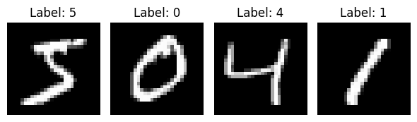

# MNIST classification taks 
The purpose of the current work is to implementa a simple MLP (Multilayer Perceptron) and the backpropagation algorithm, without specialized libries as pytorch or tensorflow, to classify images from the MNIST dataset, this with the objective to prove the simplicity behind these kind of models

## Data
MNIST is a widely-used image dataset of 700 handwritten digits with 784 features (24x24), each image represents a number in the range of 0 to 9 and is labeled with this value.

For more information, read: [MNIST-data](https://www.openml.org/d/554)
### Data preprocessing
For making the data suitable for our model we normalized our images dividing between 255 such that the fatures are values between 0 and 1, addicionally we converted our labels to oneHot vectors.

   **Why we normalize?:** Neural networks are sentive to the range of the values of the input, keeping our data values in the range  [0,1] leads to stability during the training and improves the perfromance of the model.
    
   **Why use one-shot vectors** one-shot veactors is one of the easiest ways to represent feature/labels. If we have n diferent features/labels our one-shot vector *V* will have a lenght of n, in which the position *v_i* corresponds to the i-st feature/label, an the formal equation for this feature/label is as:

$$
(V)_j =
\begin{cases}
1 & \text{si } j=i \\
0 & \text{si } j\neq i
\end{cases}
$$
