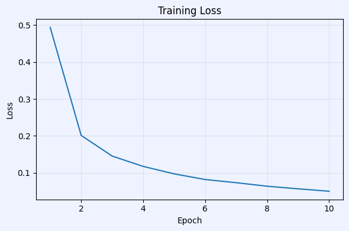
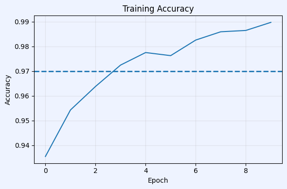

# MNIST classification taks 
The purpose of the current work is to implementa a simple MLP (Multilayer Perceptron) and the backpropagation algorithm, without specialized libries as pytorch or tensorflow, to classify images from the MNIST dataset, this with the objective to prove the simplicity behind these kind of models

## Data
MNIST is a widely-used image dataset of 700 handwritten digits with 784 features (24x24), each image represents a number in the range of 0 to 9 and is labeled with this value.

For more information, read: [MNIST-data](https://www.openml.org/d/554)
### Data preprocessing
For making the data suitable for our model we normalized our images dividing between 255 such that the fatures are values between 0 and 1, addicionally we converted our labels to one-hot vectors.

  **Why we normalize?:**  Neural networks are sentive to the range of the values of the input, keeping our data values in the range  [0,1] leads to stability during the training and improves the perfromance of the model.
    
  **Why use one-hot vectors?**  One-hot veactors is one of the easiest ways to represent feature/labels. If we have n diferent features/labels our one-hot vector *V* will have a lenght of n, in which the position *v_i* corresponds to the i-st feature/label, an the formal equation for this feature/label is as:

$$
(V)_j =
\begin{cases}
1 & \text{si } j=i \\
0 & \text{si } j\neq i
\end{cases}
$$

This kind of representation suits to manage labels for the training, getting our code more simple

To finish the preprocesing we split the data in two datasets to train and evaluate our model respectively, taking the 20% of the original dataset to evaluate.

## Model - MLP

A MLP is the result of the composition of affine transformations (Ax+b) with the posibility of have activaction functions between them. In our case we used a three-layer MLP with ReLU as activation function bewteen them, such that

$$
MLP(x) = A_3f(A_2f(A_1x +b_1)+b_2) +b_3,
$$

where A_i and b_i  are learnable matrices and bias vectors rescpectively, and f is the ReLU funtion.

As next step we passed the vector output through the softmax function to get probabilities to compare with the one-hot target vector.

## Training
As loss function we used cross entropy (L).
### Gradient Descent  and Backpropagation
We used the next rule for gradient descent

$$
\textbf{A} \gets \textbf{A}-\epsilon\nabla L\left(\textbf{A}\right)
$$ 

$$
\textbf{b} \gets \textbf{A}-\epsilon\nabla L\left(\textbf{b}\right)
$$

where $\nabla L\left(\textbf{A/b}\right)$ is the gradient of L regard to A/b. 

*During the training we split our training data in mini-batches and shuffle the data after each epoch, such that we used mini-bach Stochstic Gradient Descent*

We calculated and implemented the derivative of our funtions using the chain rule to split them in easy steps.

## Results

